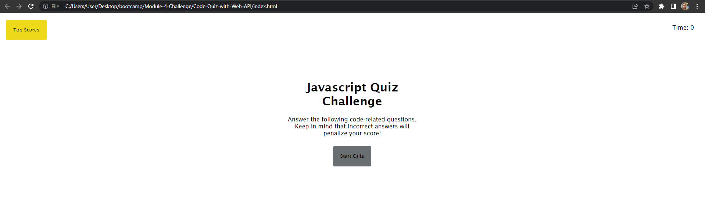

<h1> Johann's Web API Skills </h1>

This is meant to help further my Web application programming interface skills. 

<h1> User Story </h1>

GIVEN I am taking a code quiz

WHEN I click the start button

THEN a timer starts and I am presented with a question

WHEN I answer a question

THEN I am presented with another question

WHEN I answer a question incorrectly

THEN time is subtracted from the clock

WHEN all questions are answered or the timer reaches 0

THEN the game is over

WHEN the game is over

THEN I can save my initials and score

<h1> Acceptance Criteria </h1>

I WANT to take a timed quiz on JavaScript fundamentals that stores high scores

SO THAT I can gauge my progress compared to my peers

<h1> URL Links </h1>

Deployed Webpage:

<h1> Screenshot </h1>

